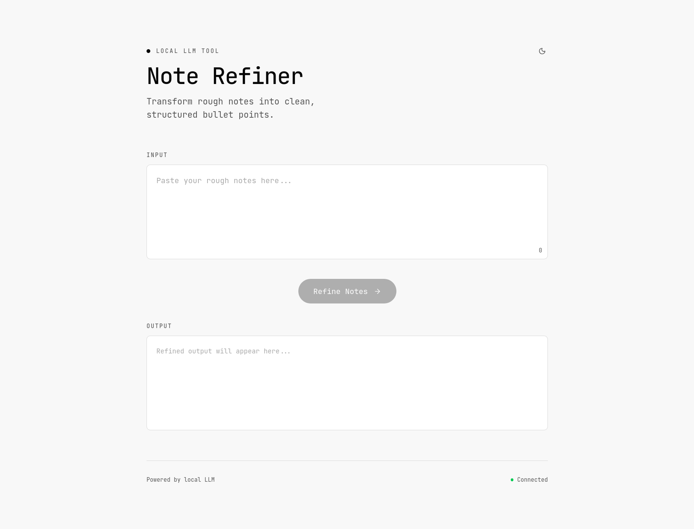
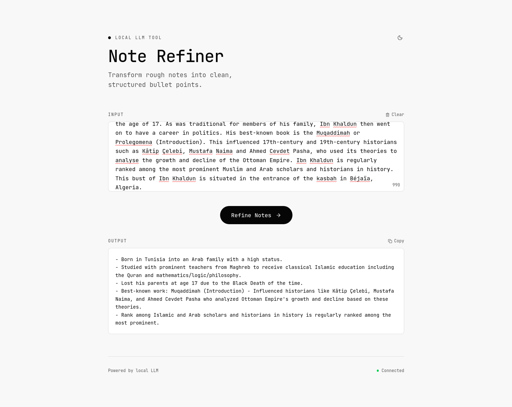

# Note Refiner — Local LLM Tool

A small frontend + backend app for refining rough notes into clean, structured bullet points using a local LLM backend.

## Overview

- **What it does:** Takes unstructured notes in the client UI and returns refined, readable bullet points.
- **Stack:** Lightweight Node.js server and a Vite React client (TypeScript).

## Repository Layout

- `server/` — Node server that talks to your local LLM runtime and exposes an API.
- `client/` — Vite + React app (UI for entering notes and viewing refined output).

## Quickstart (local)

Prerequisites: Node.js 16+ and npm.

1. Start the server

```bash
cd server
npm install
npm start
```

By default the server listens on `http://localhost:5000`.

2. Start the client

```bash
cd client
npm install
npm run dev
```

Open the client (Vite) URL shown in the terminal (usually `http://localhost:5173`).

## Screenshots






## Notes

- If your local LLM runtime (e.g., Ollama) requires additional configuration, see `server/index.js` for environment variables and adjust accordingly.
- This project is intended as a minimal local demo — feel free to extend model options, streaming, or add persistence.

